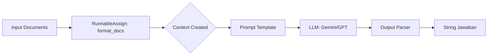

# LangChain RAG Chain: Deep Dive & Notebook Walkthrough

Dokumen ini berisi penjelasan detail mengenai implementasi Retrieval-Augmented Generation (RAG) yang ada pada notebook `2.Retrieve-Chain.ipynb`, serta analisis mendalam mengenai struktur "Chain" yang digunakan.

---

## 📚 Bagian 1: Notebook Walkthrough (`2.Retrieve-Chain.ipynb`)

Bagian ini menjelaskan alur kerja (workflow) implementasi RAG langkah demi langkah sesuai dengan yang ada di notebook.

### 1. Setup & Environment
Langkah pertama adalah menyiapkan environment agar aplikasi bisa berjalan dengan aman dan ter-monitor.
- **Loading Keys**: API Key (OpenAI, Google) diambil dari file `.env` menggunakan `python-dotenv`.
- **LangSmith Tracing**: Mengaktifkan variable `LANGSMITH_X` untuk memonitor tracing setiap step di dashboard LangSmith. Ini sangat vital untuk debugging chain yang kompleks.

### 2. Data Ingestion (Load Data)
Bagian ini mengambil data mentah dari sumber eksternal.
- **Tool**: `WebBaseLoader`.
- **Fungsi**: Mengambil konten HTML dari URL dokumentasi SQLModel (`https://sqlmodel.tiangolo.com/...`).
- **Hasil**: Output berupa list object `Document` yang berisi:
  - `page_content`: Teks asli dari halaman web.
  - `metadata`: Informasi tambahan seperti URL sumber dan judul.

### 3. Text Splitting (Chunking)
LLM memiliki batas *Context Window* (jumlah token maksimal). Kita tidak bisa mengirim seluruh isi website sekaligus.
- **Tool**: `RecursiveCharacterTextSplitter`.
- **Konsep**: Memecah dokumen panjang menjadi potongan-potongan kecil (*chunks*) agar nanti sistem hanya mengambil potongan yang relevan.
- **Parameter Penting**: `chunk_size` (ukuran potongan) dan `chunk_overlap` (irisan antar potongan agar konteks tidak terputus).

### 4. Embeddings (Penerjemah Teks ke Angka)
Agar komputer mengerti "makna" teks, teks harus diubah menjadi deretan angka (vector).
- **Konsep**: Kalimat dengan makna mirip akan memiliki nilai vector yang berdekatan.
- **Model yang digunakan di Notebook**:
    - **OpenAI**: `text-embedding-ada-002` (Standar industri yang cepat dan akurat).
    - **Ollama**: `nomic-embed-text` (Model offline/lokal, hemat biaya).
    - **Google**: `GoogleGenerativeAIEmbeddings`.
        - *Insight Khusus*: Gunakan `model="models/embedding-001"` untuk dukungan multibahasa (termasuk Indonesia) yang lebih stabil dibanding `text-embedding-004`.
        - *Tips*: Gunakan parameter `task_type="retrieval_document"` saat mengindex dokumen.

### 5. Vector Store (Database Pengetahuan)
Tempat penyimpanan vector hasil embedding agar bisa dicari dengan cepat.
- **Tool**: `FAISS` (Facebook AI Similarity Search).
- **Fungsi**: Menyimpan vector dari chunk dokumen.
- **Alur**: `Dokumen` → `Embedding Model` → `Vector` → `Disimpan di FAISS`.

### 6. Retrieval (Pencarian Semantik)
Proses mencari dokumen yang relevan dengan pertanyaan user.
- **Method**: `vecdb.similarity_search(query)`.
- **Cara Kerja**:
    1. Pertanyaan user ("Apa itu database?") diubah jadi vector.
    2. FAISS mencari vector dokumen yang paling "dekat" jaraknya dengan vector pertanyaan.
    3. Mengembalikan teks asli dari dokumen terdekat tersebut sebagai **Konteks**.

### 7. Generation (Menjawab Pertanyaan)
Tahap terakhir di mana LLM memproses konteks dan menjawab pertanyaan.
- **Models**: Notebook ini menginisialisasi 3 model chat: **OpenAI GPT-4o**, **Google Gemini Flash**, dan **Ollama Gemma**.
- **Prompt Template**:
  ```text
  Tolong jawab pertanyaan berikut hanya berdasarkan konteks yang diberikan:
  <context>
  {context}
  </context>
  ```
- **Chain Execution**: Menggabungkan Retrieval dan Generation untuk menghasilkan jawaban akhir.

---

## 🔍 Bagian 2: Analisis Teknis Struktur Chain (StuffDocumentsChain)

Di dalam notebook, terdapat struktur chain yang kompleks seperti di bawah ini. Mari kita bedah.

### Struktur Chain (`create_stuff_documents_chain`)

```python
RunnableBinding(
    bound=RunnableBinding(
        bound=RunnableAssign(mapper={
            context: RunnableLambda(format_docs)
        }),
        config={'run_name': 'format_inputs'}
    )
    | ChatPromptTemplate(...)
    | ChatGoogleGenerativeAI(...)
    | StrOutputParser(),
    config={'run_name': 'stuff_documents_chain'}
)
```

### Penjelasan Komponen

#### 1. RunnableBinding (Outer & Inner)
- **Fungsi**: Membungkus chain dengan konfigurasi tambahan.
- **`run_name`**: Memberi label (misal: `'stuff_documents_chain'`) agar mudah dilacak di LangSmith.

#### 2. RunnableAssign (Mapper)
- **Fungsi**: Memanipulasi input data yang masuk ke chain.
- **Step**: Mengambil input dokumen, lalu menjalankan fungsi `format_docs` (menggabungkan teks dokumen), dan menyimpannya ke variabel `context`.
- **Hasil**: Input awal `{documents: [...]}` berubah menjadi `{documents: [...], context: "Teks gabungan..."}`.

#### 3. ChatPromptTemplate
- **Fungsi**: Menyusun instruksi untuk LLM.
- **Proses**: Mengambil variable `{context}` yang sudah dibuat sebelumnya, lalu memasukkannya ke template prompt yang meminta LLM menjawab berdasarkan konteks itu saja.

#### 4. ChatGoogleGenerativeAI
- **Fungsi**: Otak dari sistem ini (LLM).
- **Setting**: Menggunakan `Gemini Flash` dengan `temperature=0` agar jawaban faktual dan tidak berhalusinasi.

#### 5. StrOutputParser
- **Fungsi**: Membersihkan output.
- **Hasil**: Mengubah object response kompleks dari LLM menjadi string jawaban yang bersih.

### Diagram Alur Data



---

## 🚀 Bagian 3: Solusi Modern dengan LCEL (Recommended)

Notebook masih menggunakan fungsi helper lama (`create_stuff_documents_chain`). Untuk implementasi baru yang lebih stabil dan *future-proof* di LangChain v0.2+, gunakan pendekatan **LCEL (LangChain Expression Language)**.

### Implementasi Modern

```python
from langchain_core.runnables import RunnablePassthrough
from langchain_core.output_parsers import StrOutputParser
from langchain_core.prompts import ChatPromptTemplate

# 1. Definisi Format Function
def format_docs(docs):
    return "\n\n".join(doc.page_content for doc in docs)

# 2. Definisi Prompt
template = """Jawab pertanyaan berdasarkan konteks berikut:
{context}

Pertanyaan: {question}
"""
prompt = ChatPromptTemplate.from_template(template)

# 3. Definisi Chain (LCEL)
rag_chain = (
    {
        "context": retriever | format_docs,  # Ambil dokumen -> Format jadi string
        "question": RunnablePassthrough()    # Ambil pertanyaan user
    }
    | prompt                                 # Masukkan ke prompt
    | llm                                    # Kirim ke LLM
    | StrOutputParser()                      # Ambil string jawaban
)

# 4. Eksekusi
print(rag_chain.invoke("Apa itu SQLModel?"))
```

### Kenapa LCEL Lebih Baik?
| Fitur | Legacy Chain (Helper) | LCEL (Modern) |
| :--- | :--- | :--- |
| **Transparansi** | Tersembunyi di dalam fungsi wrapper | Alur terlihat jelas di kode |
| **Fleksibilitas** | Sulit dimodifikasi | Mudah menambah step custom |
| **Streaming** | Dukungan terbatas | Streaming native (out-of-the-box) |
| **Maintenance** | Ada risiko deprecated | Standar baru LangChain |

---

## 🔗 Referensi
- [LangChain Documentation](https://python.langchain.com/docs/get_started/introduction)
- [RAG Tutorial](https://python.langchain.com/docs/tutorials/rag/)
- [Google Gemini API Models](https://ai.google.dev/models)
