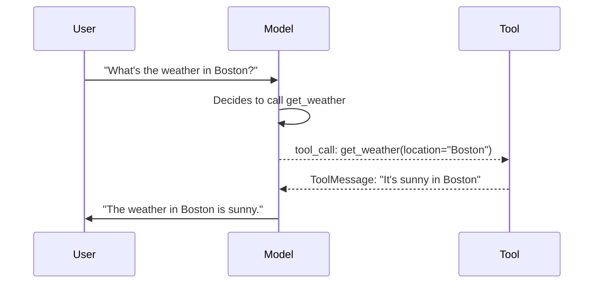
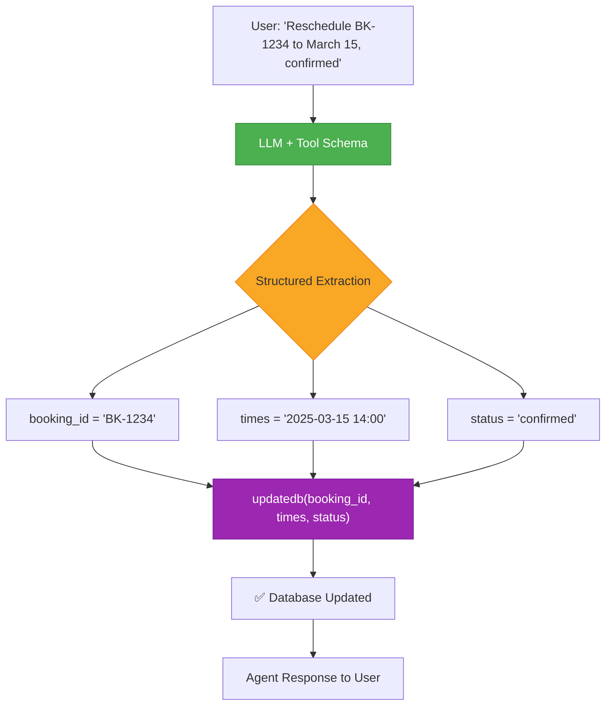
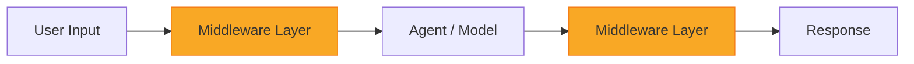
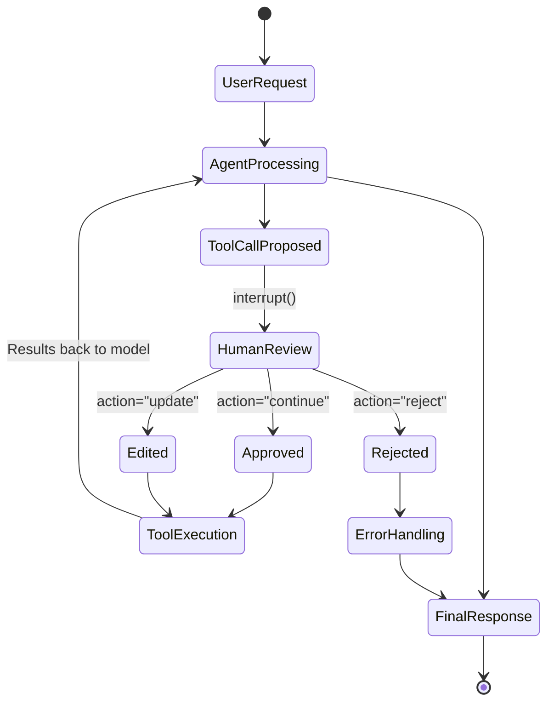
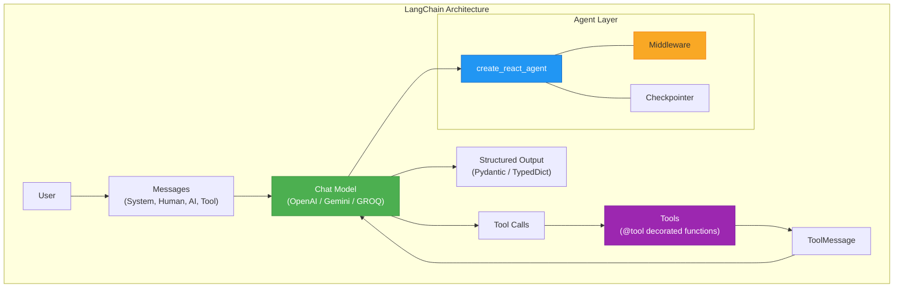

# 📘 LangChain Updated – Comprehensive Learning Resume

> **Section 10**: LangChain Updated — Model Integration, Tools, Messages, Structured Output & Middleware  
> Reference notebooks: `1-langchainintro` through `6-middleware`

---

## Table of Contents

1. [LangChain Introduction](#1-langchain-introduction)
2. [Model Integration](#2-model-integration)
3. [Tools](#3-tools)
4. [Messages](#4-messages)
5. [Structured Output](#5-structured-output)
   - [5.5 Structured Output → Tool Argument Extraction](#55-structured-output--tool-argument-extraction-agent--tool-calling)
6. [Middleware](#6-middleware)
7. [Quick Reference Cheat Sheet](#7-quick-reference-cheat-sheet)

---

## 1. LangChain Introduction

### What is LangChain?

LangChain is an open-source framework that simplifies building applications powered by Large Language Models (LLMs). It provides **unified abstractions** so you can swap between providers (OpenAI, Google, GROQ, etc.) without rewriting your code.

### Core Concepts

| Concept | Description |
|---------|-------------|
| **Chat Models** | Unified interface to interact with LLMs from any provider |
| **Messages** | Structured units of conversation (System, Human, AI, Tool) |
| **Tools** | Functions that models can call to perform external actions |
| **Chains** | Sequences of operations combining prompts, models, and tools |
| **Agents** | Autonomous systems that use LLMs to decide which tools to call |
| **Middleware** | Interceptors that modify agent behavior (logging, summarization, etc.) |

### Environment Setup

```python
import os
from dotenv import load_dotenv

load_dotenv()  # Loads .env file with API keys

# Keys are loaded automatically from .env:
# OPENAI_API_KEY, GOOGLE_API_KEY, GROQ_API_KEY
```

> [!TIP]
> Always use `dotenv` to manage API keys. Never hardcode them in your source code.

---

## 2. Model Integration

### Initializing Chat Models

LangChain provides `init_chat_model()` for a **provider-agnostic** way to create models:

```python
from langchain.chat_models import init_chat_model

# Format: "provider:model_name"
openai_model = init_chat_model("openai:gpt-4.1")
gemini_model = init_chat_model("google_genai:gemini-2.5-flash")
groq_model   = init_chat_model("groq:qwen/qwen3-32b")
```

### Basic Invocation

```python
response = openai_model.invoke("What is machine learning?")
print(response.content)  # The text response
```

### Key Response Properties

| Property | Type | Description |
|----------|------|-------------|
| `response.content` | `str` | The model's text output |
| `response.response_metadata` | `dict` | Provider info, token usage, finish reason |
| `response.usage_metadata` | `dict` | `input_tokens`, `output_tokens`, `total_tokens` |
| `response.id` | `str` | Unique run identifier |
| `response.tool_calls` | `list` | Any tool calls the model requested |

### Streaming

Stream tokens as they're generated — useful for real-time UIs:

```python
for chunk in openai_model.stream("Explain quantum computing"):
    print(chunk.content, end="", flush=True)
```

**How it works:** Each `chunk` is an `AIMessageChunk` containing a small piece of the response. The model sends these incrementally rather than waiting for the full response.

### Batch Processing

Process multiple prompts in parallel:

```python
responses = openai_model.batch([
    "What is Python?",
    "What is JavaScript?",
    "What is Rust?"
])

for resp in responses:
    print(resp.content[:100])  # First 100 chars of each
```

**Use case:** When you need to process many independent queries efficiently.

### Provider Comparison

| Feature | OpenAI | Google Gemini | GROQ |
|---------|--------|---------------|------|
| Init String | `"openai:gpt-4.1"` | `"google_genai:gemini-2.5-flash"` | `"groq:qwen/qwen3-32b"` |
| Env Variable | `OPENAI_API_KEY` | `GOOGLE_API_KEY` | `GROQ_API_KEY` |
| Streaming | ✅ | ✅ | ✅ |
| Batching | ✅ | ✅ | ✅ |
| Tool Calling | ✅ | ✅ | ✅ |
| Structured Output | ✅ | ✅ | ✅ |

---

## 3. Tools

### What Are Tools?

Tools are **functions that LLMs can call** to perform actions beyond text generation (e.g., fetch data, search the web, run code). A tool consists of:

1. **Schema** — name, description, and argument definitions
2. **Function** — the actual code that executes

### Creating a Tool

Use the `@tool` decorator to convert any function into a LangChain tool:

```python
from langchain.tools import tool

@tool
def get_weather(location: str) -> str:
    """Get the weather at a location"""
    return f"It's sunny in {location}"
```

> [!IMPORTANT]
> The **docstring** is critical — the LLM reads it to decide *when* and *how* to call the tool. Write clear, accurate descriptions.

### Binding Tools to a Model

```python
model_with_tools = model.bind_tools([get_weather])
```

This tells the model about available tools. The model can now *choose* to call them based on user input.

### Tool Calling Flow



### Tool Execution Loop (Manual)

The model doesn't execute tools itself — **you** orchestrate the loop:

```python
# Step 1: User message → Model generates tool calls
messages = [{"role": "user", "content": "What's the weather in Boston?"}]
ai_msg = model_with_tools.invoke(messages)
messages.append(ai_msg)

# Step 2: Execute each tool call
for tool_call in ai_msg.tool_calls:
    tool_result = get_weather.invoke(tool_call)
    messages.append(tool_result)

# Step 3: Pass results back → Model generates final response
final_response = model_with_tools.invoke(messages)
print(final_response.text)
# → "The weather in Boston is sunny."
```

### Accessing Tool Call Details

```python
response = model_with_tools.invoke("What's the weather in Boston?")

for tc in response.tool_calls:
    print(f"Tool: {tc['name']}")    # "get_weather"
    print(f"Args: {tc['args']}")    # {'location': 'Boston'}
    print(f"ID:   {tc['id']}")      # unique call ID
```

> [!NOTE]
> The `tool_call_id` in `ToolMessage` must match the `id` in the original tool call. This is how the model correlates results with requests.

---

## 4. Messages

### What Are Messages?

Messages are the **fundamental unit of conversation** in LangChain. They carry content and metadata needed to represent conversation state.

### Message Components

Each message has:
- **Role** — identifies the message type (system, user, AI, tool)
- **Content** — the actual data (text, images, audio, etc.)
- **Metadata** — optional fields like response info, IDs, token usage

### Message Types

| Type | Class | Purpose | Example |
|------|-------|---------|---------|
| **System** | `SystemMessage` | Sets model behavior/role | "You are a poetry expert" |
| **Human** | `HumanMessage` | User input | "Write a poem about AI" |
| **AI** | `AIMessage` | Model response | Generated text, tool calls |
| **Tool** | `ToolMessage` | Tool execution result | Weather data, search results |

### Text Prompts vs Message Prompts

**Text prompts** — simple strings for standalone requests:
```python
response = model.invoke("What is LangChain?")
```

**Message prompts** — structured lists for conversations with context:
```python
from langchain.messages import SystemMessage, HumanMessage

messages = [
    SystemMessage("You are a poetry expert"),
    HumanMessage("Write a poem about AI")
]
response = model.invoke(messages)
```

> [!TIP]
> Use **text prompts** for single, standalone requests. Use **message prompts** when you need conversation history, system instructions, or multi-turn interactions.

### SystemMessage — Setting Model Behavior

```python
# Simple system message
system_msg = SystemMessage("You are a helpful assistant")

# Detailed system message with specific instructions
system_msg = SystemMessage("""
You are a senior Python developer with expertise in web frameworks.
Always provide code examples and explain your reasoning.
Be concise but thorough in your explanations.
""")
```

### HumanMessage — User Input with Metadata

```python
human_msg = HumanMessage(
    content="Hello!",
    name="alice",     # Optional: identify different users
    id="msg_123",     # Optional: unique identifier for tracing
)
```

### AIMessage — Building Conversation History

You can manually create `AIMessage` objects to construct conversation history:

```python
from langchain.messages import AIMessage

# Simulate prior conversation
messages = [
    SystemMessage("You are a helpful assistant"),
    HumanMessage("Can you help me?"),
    AIMessage("I'd be happy to help!"),       # Manual AI response
    HumanMessage("Great! What's 2+2?")
]
response = model.invoke(messages)
```

### ToolMessage — Returning Tool Results

```python
from langchain.messages import ToolMessage

# After model requests a tool call:
ai_message = AIMessage(
    content=[],
    tool_calls=[{
        "name": "get_weather",
        "args": {"location": "San Francisco"},
        "id": "call_123"
    }]
)

# Create result message (ID must match!)
tool_message = ToolMessage(
    content="Sunny, 72°F",
    tool_call_id="call_123"
)

# Feed back to model
messages = [
    HumanMessage("What's the weather in SF?"),
    ai_message,
    tool_message,
]
response = model.invoke(messages)
```

### Accessing Response Metadata

```python
response = model.invoke(messages)
print(response.usage_metadata)
# {'input_tokens': 53, 'output_tokens': 258, 'total_tokens': 311}
```

---

## 5. Structured Output

### Why Structured Output?

Instead of free-form text, you can force models to output **structured data** that follows a defined schema — perfect for APIs, databases, and downstream processing.

### Method 1: Pydantic Models (Recommended)

```python
from pydantic import BaseModel, Field

class Movie(BaseModel):
    """Schema for movie information"""
    title: str = Field(description="The movie title")
    director: str = Field(description="The director's name")
    year: int = Field(description="Release year")

# Bind schema to model
structured_model = model.with_structured_output(Movie)
result = structured_model.invoke("Tell me about Inception")

print(result.title)     # "Inception"
print(result.director)  # "Christopher Nolan"
print(result.year)      # 2010
print(type(result))     # <class 'Movie'>
```

### Nested Pydantic Models

```python
class Actor(BaseModel):
    name: str = Field(description="Actor's full name")
    role: str = Field(description="Character played")

class MovieDetails(BaseModel):
    title: str = Field(description="Movie title")
    director: str = Field(description="Director's name")
    year: int = Field(description="Release year")
    actors: list[Actor] = Field(description="Main cast")

structured_model = model.with_structured_output(MovieDetails)
result = structured_model.invoke("Tell me about The Dark Knight")

for actor in result.actors:
    print(f"{actor.name} as {actor.role}")
```

### Method 2: TypedDict

```python
from typing import TypedDict, Optional

class ContactInfo(TypedDict):
    name: str
    email: str
    phone: Optional[str]

structured_model = model.with_structured_output(ContactInfo)
result = structured_model.invoke("Extract: John Doe, john@example.com, 555-1234")
# result = {'name': 'John Doe', 'email': 'john@example.com', 'phone': '555-1234'}
```

### Method 3: Dataclasses

```python
from dataclasses import dataclass, field

@dataclass
class Product:
    name: str
    price: float
    category: str

structured_model = model.with_structured_output(Product)
result = structured_model.invoke("iPhone 15 Pro, $999, Electronics")
```

### Comparison of Approaches

| Approach | Validation | Default Values | Nesting | Type |
|----------|-----------|----------------|---------|------|
| **Pydantic** | ✅ Built-in | ✅ | ✅ Deep | Object |
| **TypedDict** | ❌ None | ❌ | ⚠️ Limited | Dict |
| **Dataclass** | ❌ None | ✅ | ⚠️ Limited | Object |

> [!TIP]
> Use **Pydantic** for production code — it provides validation, serialization, and the best IDE support. Use `Field(description=...)` to guide the model.

---

## 5.5 Structured Output → Tool Argument Extraction (Agent + Tool Calling)

### The Problem

You have a function like `updatedb(booking_id, times, status)` and want an **AI agent** to automatically:
1. **Parse** natural language → extract the correct arguments
2. **Call** the function with those arguments

This is the sweet spot where **structured output** meets **tool calling**.

### Step 1: Define the Tool with Type Hints

The `@tool` decorator uses your function's **type hints + docstring** as the schema. The LLM reads this to know what arguments to extract.

```python
from langchain.tools import tool
from datetime import datetime

@tool
def updatedb(booking_id: str, times: str, status: str) -> str:
    """Update a booking record in the database.

    Args:
        booking_id: The unique booking identifier (e.g. 'BK-1234')
        times: The new date/time for the booking (e.g. '2025-03-15 14:00')
        status: The booking status — one of 'confirmed', 'cancelled', 'pending'
    """
    # In production, this would hit your actual database
    print(f"✅ DB Updated: {booking_id} → time={times}, status={status}")
    return f"Booking {booking_id} updated: time={times}, status={status}"
```

> [!IMPORTANT]
> The **docstring with Args descriptions** is what the LLM uses to understand each parameter. Be specific — include examples and allowed values.

### Step 2: Bind Tool to Model → LLM Extracts Arguments Automatically

```python
from langchain.chat_models import init_chat_model

model = init_chat_model("openai:gpt-4.1")
model_with_tools = model.bind_tools([updatedb])

# User says this in natural language:
response = model_with_tools.invoke(
    "Please reschedule booking BK-1234 to March 15th 2025 at 2pm and mark it confirmed"
)

# The LLM automatically extracts structured arguments:
print(response.tool_calls)
# [{'name': 'updatedb',
#   'args': {'booking_id': 'BK-1234',
#            'times': '2025-03-15 14:00',
#            'status': 'confirmed'},
#   'id': 'call_abc123'}]
```

### Step 3: Execute the Tool Call

```python
# Execute the tool with extracted arguments
for tool_call in response.tool_calls:
    result = updatedb.invoke(tool_call)
    print(result)
    # → "Booking BK-1234 updated: time=2025-03-15 14:00, status=confirmed"
```

### Full Agent (Automatic Loop)

Use `create_react_agent` for a fully automated extract → call → respond loop:

```python
from langgraph.prebuilt import create_react_agent
from langgraph.checkpoint.memory import InMemorySaver

agent = create_react_agent(
    model=model,
    tools=[updatedb],
    checkpointer=InMemorySaver(),
)

config = {"configurable": {"thread_id": "booking-session-1"}}

# The agent handles everything: parse → call tool → return response
response = agent.invoke(
    {"messages": [{"role": "user",
                   "content": "Reschedule BK-1234 to March 15 2025 2pm, mark confirmed"}]},
    config=config,
)

print(response["messages"][-1].content)
# → "I've updated booking BK-1234: rescheduled to March 15, 2025 at 2:00 PM
#    and marked as confirmed."
```

### Alternative: Pydantic Schema for Extraction Only (No Execution)

If you **only** need to extract arguments (without executing a function), use `with_structured_output`:

```python
from pydantic import BaseModel, Field
from enum import Enum

class BookingStatus(str, Enum):
    confirmed = "confirmed"
    cancelled = "cancelled"
    pending = "pending"

class UpdateDBArgs(BaseModel):
    """Arguments for updating a booking in the database."""
    booking_id: str = Field(description="Unique booking ID, e.g. 'BK-1234'")
    times: str = Field(description="New date/time, e.g. '2025-03-15 14:00'")
    status: BookingStatus = Field(description="Booking status")

structured_model = model.with_structured_output(UpdateDBArgs)
result = structured_model.invoke(
    "Change booking BK-5678 to April 1st 10am and cancel it"
)

print(result.booking_id)  # "BK-5678"
print(result.times)       # "2025-04-01 10:00"
print(result.status)      # BookingStatus.cancelled

# Then call your function manually:
updatedb.invoke({"booking_id": result.booking_id,
                 "times": result.times,
                 "status": result.status.value})
```

### When to Use Which Approach

| Approach | Best For | Auto-Execute? |
|----------|----------|---------------|
| `@tool` + `bind_tools` | Agent decides **when** to call the tool | Manual loop |
| `create_react_agent` | Full automation — parse, call, respond | ✅ Yes |
| `with_structured_output` | Extract args only, execute separately | ❌ No |

### Flow Diagram



> [!NOTE]
> The `@tool` approach (with `bind_tools` or `create_react_agent`) is usually preferred because the LLM automatically decides **when** to call the tool based on user intent. Use `with_structured_output` when you always want extraction regardless of intent.

---

## 6. Middleware

### What is Middleware?

Middleware are **interceptors** that sit between the user and the agent, modifying behavior at specific points in the execution pipeline.



### Common Middleware Use Cases

| Use Case | Description |
|----------|-------------|
| **Logging** | Record all inputs/outputs for debugging |
| **Prompt Transformation** | Modify prompts before they reach the model |
| **Retries** | Automatically retry on failures |
| **Guardrails** | Block unsafe or inappropriate content |
| **Summarization** | Compress long conversations to fit token limits |
| **Human-in-the-Loop** | Pause for human approval before executing tools |

---

### SummarizationMiddleware

Automatically **summarizes conversation history** when it gets too long, preventing token limit errors.

#### Setup

```python
from langgraph.prebuilt import create_react_agent
from langgraph.checkpoint.memory import InMemorySaver
from langchain.chat_models import init_chat_model

model = init_chat_model("openai:gpt-4.1")
checkpointer = InMemorySaver()
```

#### Configuration Options

```python
from langgraph.prebuilt.chat_agent_executor import SummarizationMiddleware

summarization = SummarizationMiddleware(
    # Trigger: summarize after token count exceeds this limit
    max_summary_tokens=200,
    
    # Trigger alternative: summarize after N messages
    # max_summary_messages=10,
    
    # Keep this many recent messages un-summarized
    initial_summary_messages=2,
)
```

| Parameter | Type | Description |
|-----------|------|-------------|
| `max_summary_tokens` | `int` | Max tokens before triggering summarization |
| `max_summary_messages` | `int` | Max messages before triggering summarization |
| `initial_summary_messages` | `int` | Number of recent messages to keep verbatim |

#### Creating the Agent

```python
agent = create_react_agent(
    model=model,
    tools=[search_hotels],              # Your tools
    checkpointer=checkpointer,          # For state persistence
    middleware=[summarization],          # Attach middleware
)
```

#### How It Works

1. User and agent exchange messages normally
2. When conversation exceeds the token/message threshold, middleware triggers
3. Older messages are **compressed into a summary**
4. Recent messages (count = `initial_summary_messages`) are kept as-is
5. Future interactions continue with the summary + recent messages

> [!NOTE]
> Summarization is transparent to the user — they don't see the summary. It only affects internal context management.

---

### HumanInTheLoopMiddleware

Pauses agent execution to **request human approval** before executing sensitive tool calls.

#### Setup

```python
from langgraph.prebuilt.chat_agent_executor import HumanInTheLoopMiddleware
from langgraph.types import interrupt

# Define a review function
def review_tool_call(tool_call) -> str:
    """Pause execution and ask human to approve, reject, or edit."""
    human_review = interrupt({
        "question": "Is this correct?",
        "tool_call": tool_call
    })
    
    action = human_review.get("action")
    
    if action == "continue":
        return tool_call          # Approve as-is
    elif action == "reject":
        raise Exception("Tool call rejected by human")
    elif action == "update":
        return human_review.get("updated_tool_call")  # Use edited version

# Create middleware
human_in_the_loop = HumanInTheLoopMiddleware(
    review_tool_call=review_tool_call
)
```

#### Creating the Agent

```python
agent = create_react_agent(
    model=model,
    tools=[send_email_tool, read_email_tool],
    checkpointer=checkpointer,
    middleware=[human_in_the_loop],
)
```

#### Action: Approve

```python
config = {"configurable": {"thread_id": "1"}}

# Agent proposes tool call → execution pauses
response = agent.invoke(
    {"messages": [{"role": "user", "content": "Send email to bob@test.com"}]},
    config=config
)

# Human approves
agent.invoke(
    command=Command(resume={"action": "continue"}),
    config=config
)
```

#### Action: Reject

```python
agent.invoke(
    command=Command(resume={"action": "reject"}),
    config=config
)
```

#### Action: Edit & Approve

```python
# Modify the tool call before approving
agent.invoke(
    command=Command(resume={
        "action": "update",
        "updated_tool_call": {
            "name": "send_email_tool",
            "args": {
                "to": "corrected@email.com",    # Changed!
                "subject": "Updated Subject",
                "body": "Corrected body text"
            }
        }
    }),
    config=config
)
```

### Human-in-the-Loop Flow



> [!CAUTION]
> Always implement human-in-the-loop for tools that have **side effects** (sending emails, modifying databases, making payments). Read-only tools typically don't need approval.

---

## 7. Quick Reference Cheat Sheet

### Imports

```python
# Models
from langchain.chat_models import init_chat_model

# Messages
from langchain.messages import SystemMessage, HumanMessage, AIMessage, ToolMessage

# Tools
from langchain.tools import tool

# Structured Output
from pydantic import BaseModel, Field

# Agent & Middleware
from langgraph.prebuilt import create_react_agent
from langgraph.checkpoint.memory import InMemorySaver
from langgraph.prebuilt.chat_agent_executor import (
    SummarizationMiddleware,
    HumanInTheLoopMiddleware
)
from langgraph.types import interrupt, Command
```

### Common Patterns

```python
# 1. Quick model call
model = init_chat_model("openai:gpt-4.1")
response = model.invoke("Hello!")

# 2. With system instruction
response = model.invoke([
    SystemMessage("You are helpful"),
    HumanMessage("What is AI?")
])

# 3. Streaming
for chunk in model.stream("Explain LangChain"):
    print(chunk.content, end="")

# 4. Batch
results = model.batch(["Q1?", "Q2?", "Q3?"])

# 5. Structured output
class Info(BaseModel):
    name: str
    age: int

result = model.with_structured_output(Info).invoke("John is 30")

# 6. Tool calling
@tool
def search(query: str) -> str:
    """Search the web"""
    return f"Results for {query}"

model_with_tools = model.bind_tools([search])
response = model_with_tools.invoke("Search for Python tutorials")

# 7. Agent with middleware
agent = create_react_agent(
    model=model,
    tools=[search],
    checkpointer=InMemorySaver(),
    middleware=[SummarizationMiddleware(max_summary_tokens=500)]
)
```

### Architecture Overview



---

> **📝 Note:** This resume covers Section 10 of the LangChain Updated course. For hands-on practice, run the corresponding notebooks (`1-langchainintro.ipynb` through `6-middleware.ipynb`) in the course directory.
