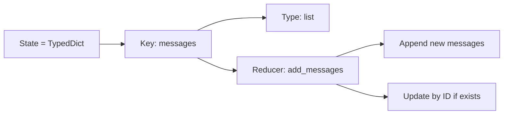
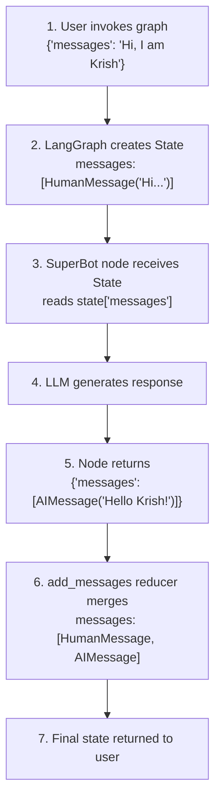

# LangGraph State: `TypedDict`, `Annotated`, `add_messages` Explained

Reference from: [2-chatbot.ipynb](file:///d:/PROJECTS/AgenticAI_LangGraph-LangChain/Lecturer/Section%2011-LangGraph%20Get%20Started/2-chatbot.ipynb)

---

## 1. The Notebook Overview

This notebook builds a **simple chatbot using LangGraph**. The key flow is:

```
START → SuperBot (LLM node) → END
```

The core setup code:

```python
from typing_extensions import TypedDict
from langgraph.graph import StateGraph, START, END
from typing import Annotated
from langgraph.graph.message import add_messages

class State(TypedDict):
    messages: Annotated[list, add_messages]
```

Let's break down **each piece**.

---

## 2. `TypedDict` — `typing_extensions` vs `typing`

### What is `TypedDict`?

`TypedDict` lets you create a **dictionary type with specific keys and value types**. Unlike a regular class, instances are still **plain `dict` objects** at runtime — the type hints are just for static analysis and documentation.

```python
class State(TypedDict):
    messages: list   # key "messages" must hold a list
```

This means `State` is essentially `{"messages": [...]}` — a normal dict, but with **type guarantees**.

### Why `typing_extensions.TypedDict` instead of `typing.TypedDict`?

| Feature | `typing.TypedDict` | `typing_extensions.TypedDict` |
|---|---|---|
| **Available since** | Python 3.8 | Backported to **any** Python version |
| **Latest features** | Only what your Python version supports | Always has the **newest features** (e.g., `Required[]`, `NotRequired[]`, class inheritance improvements) |
| **LangGraph's choice** | ❌ Not used | ✅ **Used by LangGraph** |

### Key differences in practice:

```python
# typing (standard library) — features depend on your Python version
from typing import TypedDict

# typing_extensions — always has the latest TypedDict features
from typing_extensions import TypedDict
```

**Why LangGraph uses `typing_extensions`:**
- **Consistency** — works the same across Python 3.8, 3.9, 3.10, 3.11, 3.12+
- **Advanced features** — `typing_extensions.TypedDict` supports newer features like `Required[]`, `NotRequired[]`, and better class inheritance that may not exist in your `typing.TypedDict`
- **Best practice** — library authors use `typing_extensions` to ensure compatibility

> [!TIP]
> **Rule of thumb:** If you're building a library or using LangGraph, import `TypedDict` from `typing_extensions`. For simple scripts on Python 3.12+, `typing.TypedDict` is fine too.

### TypedDict vs Regular Dict vs Dataclass/Pydantic

```python
# Regular dict — no type safety
state = {"messages": [1, 2, 3], "random_key": "oops"}  # anything goes

# TypedDict — typed dict, still a plain dict at runtime
class State(TypedDict):
    messages: list
state: State = {"messages": [1, 2, 3]}  # type-checked keys & values

# Dataclass — real class with attributes
@dataclass
class State:
    messages: list
state = State(messages=[1, 2, 3])  # access via state.messages

# Pydantic — validated class
class State(BaseModel):
    messages: list
state = State(messages=[1, 2, 3])  # validated + access via state.messages
```

**LangGraph uses `TypedDict`** because the state is passed around as a **plain dict** — nodes receive it as a dict and return dicts. This keeps things simple and lightweight.

---

## 3. `Annotated` — Adding Metadata to Types

### What is `Annotated`?

`Annotated` from `typing` lets you **attach extra metadata** to a type hint without changing the type itself.

```python
from typing import Annotated

# Syntax: Annotated[<actual_type>, <metadata1>, <metadata2>, ...]
messages: Annotated[list, add_messages]
#                   ^^^^  ^^^^^^^^^^^^
#                   type   metadata (the reducer function)
```

### How it works conceptually:

```python
# Without Annotated — just a plain list
messages: list

# With Annotated — it's still a list, BUT LangGraph knows
# to use add_messages as the "reducer" for this field
messages: Annotated[list, add_messages]
```

- The **first argument** (`list`) is the actual type
- The **second argument** (`add_messages`) is metadata — LangGraph reads this to know **how to update** this field

> [!IMPORTANT]
> `Annotated` does NOT change the runtime type. It's still a `list`. The metadata is used by **frameworks** (like LangGraph) to add behavior.

---

## 4. `add_messages` — The Reducer Function

### What is a Reducer?

In LangGraph, a **reducer** defines **how state updates are merged**. Without a reducer, a new value **replaces** the old value. With a reducer, values are **combined intelligently**.

### Without Reducer (Replace behavior):

```python
class State(TypedDict):
    messages: list  # NO reducer

# State starts as: {"messages": ["Hello"]}
# Node returns:    {"messages": ["Hi back"]}
# Result:          {"messages": ["Hi back"]}  ← REPLACED! "Hello" is GONE
```

### With `add_messages` Reducer (Append behavior):

```python
class State(TypedDict):
    messages: Annotated[list, add_messages]  # WITH reducer

# State starts as: {"messages": [HumanMessage("Hello")]}
# Node returns:    {"messages": [AIMessage("Hi back")]}
# Result:          {"messages": [HumanMessage("Hello"), AIMessage("Hi back")]}
#                                ← APPENDED! Both messages preserved
```

### What `add_messages` specifically does:

1. **Appends** new messages to the existing list (conversation keeps growing)
2. **Deduplicates by ID** — if a new message has the same `id` as an existing one, it **replaces** that specific message instead of appending
3. **Handles type conversion** — can accept strings, dicts, or Message objects

```
add_messages(existing_messages, new_messages) → merged_messages
```

This is **essential for chatbots** — you want the conversation history to grow, not get overwritten each step.

---

## 5. `class State(TypedDict)` — Putting It All Together

```python
class State(TypedDict):
    messages: Annotated[list, add_messages]
```

### What this creates:



### How it flows in the chatbot:



### Step-by-step what happens in the notebook:

**Step 1 — Define the node function:**
```python
def superbot(state: State):
    return {"messages": [llm_groq.invoke(state['messages'])]}
```
- Receives the full `State` dict
- Reads `state['messages']` (the conversation history)
- Calls the LLM with the full history
- Returns a dict with `"messages"` key containing the AI response

**Step 2 — Build the graph:**
```python
graph = StateGraph(State)          # Graph uses State as its schema
graph.add_node("SuperBot", superbot)  # Register node
graph.add_edge(START, "SuperBot")     # START → SuperBot
graph.add_edge("SuperBot", END)       # SuperBot → END
graph_builder = graph.compile()       # Compile into runnable
```

**Step 3 — Invoke:**
```python
graph_builder.invoke({'messages': "Hi, My name is Krish And I like cricket"})
```
- The string `"Hi, My name is Krish..."` is automatically converted to a `HumanMessage` by `add_messages`
- The LLM responds, and `add_messages` appends the AI response
- Final output contains **both** the human and AI messages

**Step 4 — Streaming (alternative):**
```python
for event in graph_builder.stream({"messages": "Hello My name is Krish"}):
    print(event)
```
- Same as invoke, but streams node outputs as they complete
- Each event is `{"NodeName": {"messages": [...]}}` — showing which node produced what

---

## 6. Quick Summary Table

| Concept | What it does | Why it matters |
|---|---|---|
| `TypedDict` (from `typing_extensions`) | Creates a typed dictionary class | Defines the **shape** of the graph state; backport-safe |
| `Annotated[type, metadata]` | Attaches metadata to a type | Tells LangGraph **how** to process updates for a field |
| `add_messages` | Reducer function for message lists | **Appends** messages instead of replacing; enables conversation history |
| `class State(TypedDict)` | The graph's state schema | Combines all the above — defines **what** state holds and **how** it updates |

> [!NOTE]
> The `State` class is the **central contract** of a LangGraph graph. Every node reads from it and writes to it. The reducer (`add_messages`) determines the merge strategy, making it possible to build **stateful, multi-turn conversations**.
