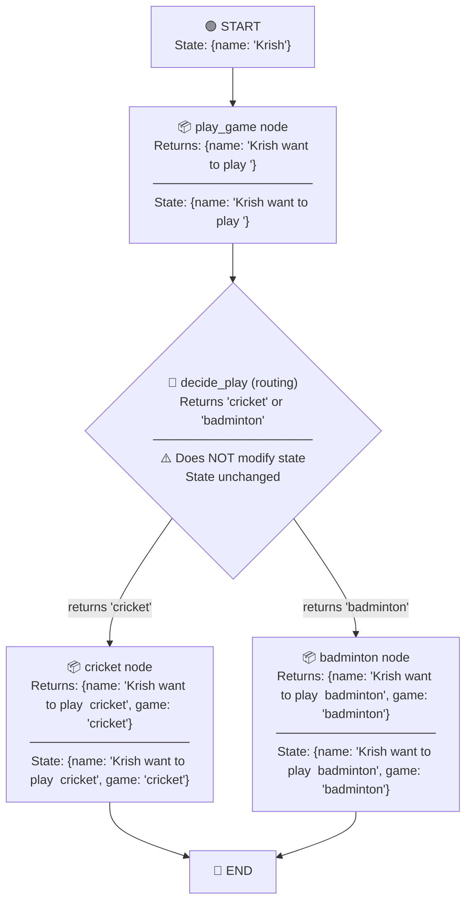

# LangGraph State Flow with TypedDict — Complete Walkthrough

## 🔑 Key Question
> **In `play_game`, the node updates `state["name"]`. But `decide_play` just returns a string like `"cricket"`. How can it modify the state?**

**Answer: It doesn't modify the state. `decide_play` is NOT a node — it's a *routing function* (used with `add_conditional_edges`).** Its only job is to tell LangGraph **which node to go to next**. The string it returns is a **node name**, not a state update.

---

## The Code

```python
from typing_extensions import TypedDict
from typing import Literal

class TypedDictState(TypedDict):
    name: str
    game: Literal["cricket", "badminton"]
```

```python
# --- NODES (modify state) ---

def play_game(state: TypedDictState):
    print("---Play Game node has been called--")
    return {"name": state['name'] + " want to play "}

def cricket(state: TypedDictState):
    print("-- Cricket node has been called--")
    return {"name": state["name"] + " cricket", "game": "cricket"}

def badminton(state: TypedDictState):
    print("-- badminton node has been called--")
    return {"name": state["name"] + " badminton", "game": "badminton"}
```

```python
# --- ROUTING FUNCTION (does NOT modify state) ---

import random
def decide_play(state: TypedDictState) -> Literal["cricket", "badminton"]:
    if random.random() < 0.5:
        return "cricket"      # ← this is a NODE NAME, not a state value
    else:
        return "badminton"    # ← this is a NODE NAME, not a state value
```

```python
# --- GRAPH CONSTRUCTION ---

builder = StateGraph(TypedDictState)
builder.add_node("playgame", play_game)    # registered as node
builder.add_node("cricket", cricket)        # registered as node
builder.add_node("badminton", badminton)    # registered as node

builder.add_edge(START, "playgame")
builder.add_conditional_edges("playgame", decide_play)  # ← routing function, NOT a node
builder.add_edge("cricket", END)
builder.add_edge("badminton", END)

graph = builder.compile()
```

---

## Two Types of Functions in LangGraph

| | **Node Function** | **Routing Function** |
|---|---|---|
| **Registered with** | `add_node()` | `add_conditional_edges()` |
| **Purpose** | **Modify state** | **Decide which node runs next** |
| **Returns** | `dict` (partial state update) | `str` (name of next node) |
| **Example** | `play_game`, `cricket`, `badminton` | `decide_play` |
| **Modifies state?** | ✅ Yes | ❌ No |

---

## Step-by-Step State Flow

Input: `graph.invoke({"name": "Krish"})`



### Detailed Step Breakdown

#### Step 1 — `START` → State Initialization
```python
# You invoke the graph with initial state:
graph.invoke({"name": "Krish"})

# LangGraph creates the state dict:
state = {"name": "Krish"}  # 'game' is not set yet (TypedDict doesn't enforce keys)
```

#### Step 2 — `play_game` node runs (STATE IS MODIFIED ✅)
```python
def play_game(state: TypedDictState):
    return {"name": state['name'] + " want to play "}
    # Returns: {"name": "Krish want to play "}

# LangGraph MERGES the returned dict into state:
# state["name"] = "Krish want to play "
# State is now: {"name": "Krish want to play "}
```

> [!IMPORTANT]
> **How state update works with TypedDict**: Nodes return a **partial dict**. LangGraph **merges** (overwrites) only the keys you return. You don't need to return the entire state — only the keys you want to change.

#### Step 3 — `decide_play` runs (STATE IS NOT MODIFIED ❌)
```python
def decide_play(state: TypedDictState) -> Literal["cricket", "badminton"]:
    if random.random() < 0.5:
        return "cricket"
    else:
        return "badminton"
    # Returns: "cricket" (just a string — a node name)

# LangGraph uses this return value to ROUTE to the next node.
# State remains: {"name": "Krish want to play "}
# Nothing is written to state!
```

> [!CAUTION]
> `decide_play` receives the state as input (so it can **read** state to make decisions), but its return value is used for **routing only** — it is NOT merged into state.

#### Step 4a — If routed to `cricket` node (STATE IS MODIFIED ✅)
```python
def cricket(state: TypedDictState):
    return {"name": state["name"] + " cricket", "game": "cricket"}
    # Returns: {"name": "Krish want to play  cricket", "game": "cricket"}

# LangGraph MERGES into state:
# Final state: {"name": "Krish want to play  cricket", "game": "cricket"}
```

#### Step 4b — If routed to `badminton` node (STATE IS MODIFIED ✅)
```python
def badminton(state: TypedDictState):
    return {"name": state["name"] + " badminton", "game": "badminton"}
    # Returns: {"name": "Krish want to play  badminton", "game": "badminton"}

# LangGraph MERGES into state:
# Final state: {"name": "Krish want to play  badminton", "game": "badminton"}
```

#### Step 5 — `END`
```python
# graph.invoke() returns the final state:
# {"name": "Krish want to play  cricket", "game": "cricket"}
```

---

## State Snapshot at Each Step

| Step | Function | Type | State After |
|------|----------|------|------------|
| 0 | `invoke()` | Input | `{"name": "Krish"}` |
| 1 | `play_game` | **Node** | `{"name": "Krish want to play "}` |
| 2 | `decide_play` | **Router** | `{"name": "Krish want to play "}` ← **unchanged** |
| 3 | `cricket` | **Node** | `{"name": "Krish want to play  cricket", "game": "cricket"}` |
| 4 | `END` | Terminal | final state returned |

---

## How LangGraph Merges State (TypedDict)

With `TypedDict` state schema (no `Annotated` reducer):

```python
class TypedDictState(TypedDict):
    name: str
    game: Literal["cricket", "badminton"]
```

The **default behavior is key-level overwrite**:

```python
# Before node runs:
state = {"name": "Krish"}

# Node returns:
update = {"name": "Krish want to play "}

# LangGraph does:
state.update(update)  # simple dict merge — overwrites matching keys

# After:
state = {"name": "Krish want to play "}
```

> [!NOTE]
> If you want **append/accumulate** behavior (like for message lists), you use `Annotated[list, add_messages]` as the type hint. Without `Annotated`, it's always **overwrite**.

---

## Summary

| Concept | Explanation |
|---------|-------------|
| **TypedDict state** | A plain Python dict with type hints. No runtime validation. |
| **Node function** | Registered via `add_node()`. Returns a `dict` → **merged into state** |
| **Routing function** | Used in `add_conditional_edges()`. Returns a `str` → **used for routing, NOT merged** |
| **State update** | Default behavior is **key-level overwrite** (no Annotated = no reducer) |
| **`decide_play`** | Can READ state but CANNOT WRITE to state. Its return is a node name. |
